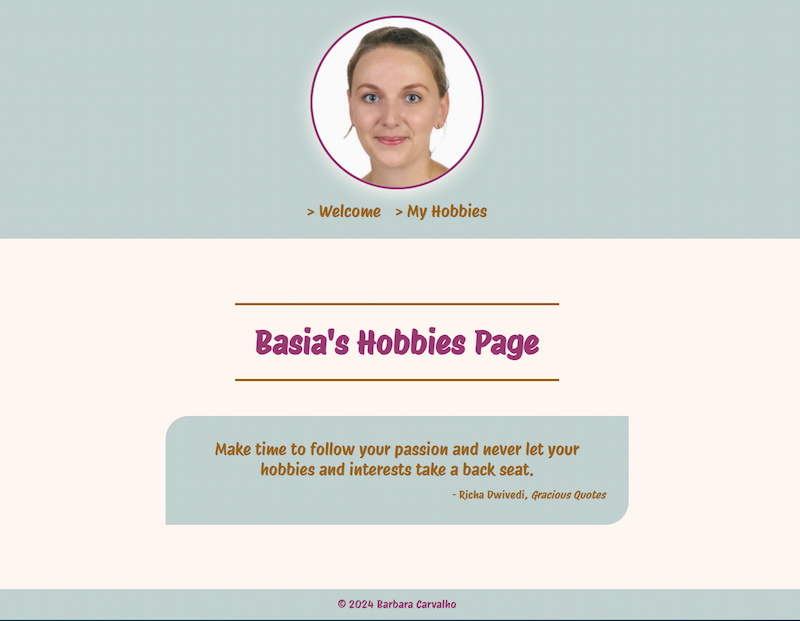
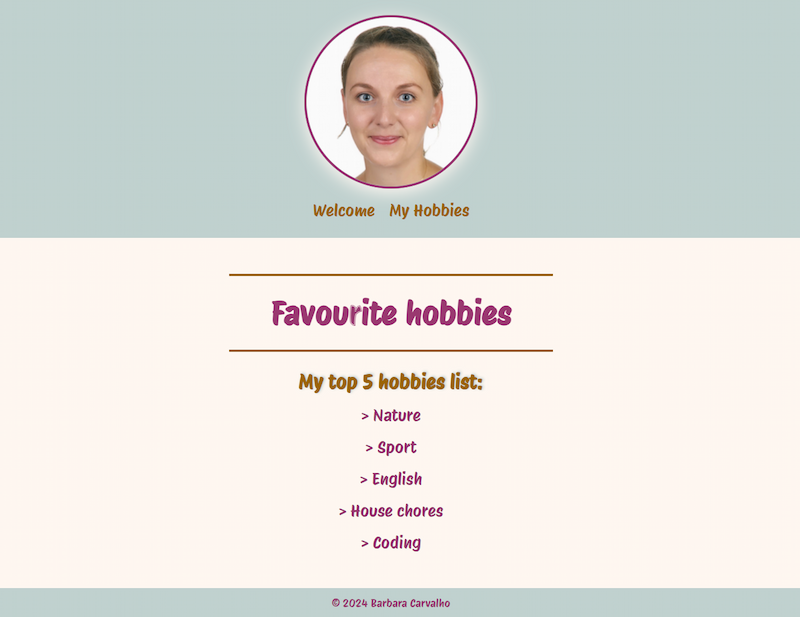
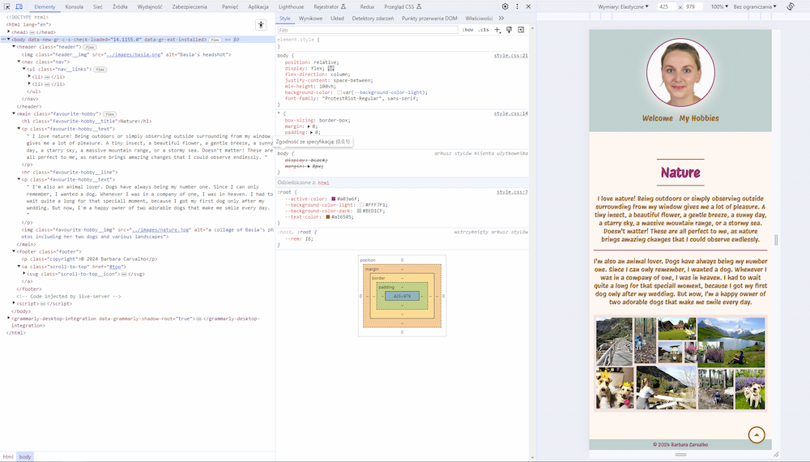

### kreativstorm-website-hobbies
## 🌞🌷🐶🏖️🏔️💪 Hobbies Page 🎓📚🧁🏡💻👨🏼‍💻

## Table of contents
  - [Overview](#overview)
  - [The Project](#the-project)
  - [Links](#links)
  - [Screenshots](#screenshots)
  - [Technology stack](#technology-stack)

## Overview

### The Project
A responsive website consisiting of several pages:
- Welcome page, 
- Hobbies page,
- "Nature" as a hobby page,
- "Sport" as a hobby page,
- "Engish" as a hobby page,
- "House Chores" as a hobby page,
- "Coding" as a hobby page.

### Links
- Solution URL: [Github](https://github.com/basiacarvalho/kreativstorm-website-hobbies/settings/pages)
- Live Site URL: [Live demo](https://basiacarvalho.github.io/kreativstorm-website-hobbies/)

### Screenshots

### Technology stack
- HTML
- CSS
- JavaScript
